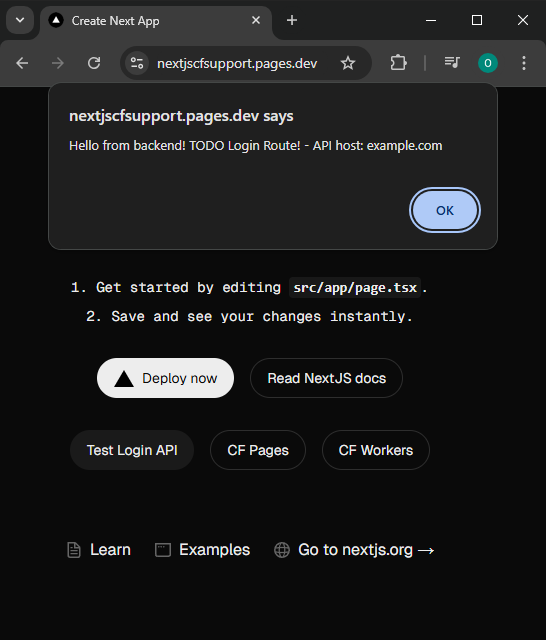

# Instructions to use Next.JS with CF FullStack

[Demo](https://nextjscfsupport.pages.dev)



> [!IMPORTANT]  
> You don't have to clone this repository, The entire reproduction steps can be found below!

## Next.JS SSG (Static Site Generation)

By default, Next.js pre-renders pages using [Static Generation](https://nextjs.org/docs/pages/building-your-application/rendering/static-site-generation) without fetching data. Here's an example:

```ts
function About() {
  return <div>About</div>
}
 
export default About
```

**But, You need to understand [Static Exports](https://nextjs.org/docs/pages/building-your-application/deploying/static-exports)**

## Instructions

### 1. Create a new Next.JS project or use an existing one

```bash
npx create-next-app@latest

cd my-app

pnpm dev

http://localhost:3000

CTRL+C
```

```bash
pnpm add -D @cloudflare/workers-types
```

### 2. Create wrangler.toml

Modify the name in `wrangler.toml`

```toml
#:schema node_modules/wrangler/config-schema.json
name = "nextjscfsupport"
compatibility_date = "2024-12-20"
pages_build_output_dir = "./out"
# compatibility_flags = ["nodejs_compat"]

[vars]
API_HOST = "example.com"
API_ACCOUNT_ID = "example_user"
SERVICE_X_DATA = { URL = "service-x-api.dev.example", MY_ID = 123 }

# Automatically place your workloads in an optimal location to minimize latency.
# If you are running back-end logic in a Pages Function, running it closer to your back-end infrastructure
# rather than the end user may result in better performance.
# Docs: https://developers.cloudflare.com/pages/functions/smart-placement/#smart-placement
# [placement]
# mode = "smart"

# Variable bindings. These are arbitrary, plaintext strings (similar to environment variables)
# Docs:
# - https://developers.cloudflare.com/pages/functions/bindings/#environment-variables
# Note: Use secrets to store sensitive data.
# - https://developers.cloudflare.com/pages/functions/bindings/#secrets
# [vars]
# MY_VARIABLE = "production_value"

# Bind the Workers AI model catalog. Run machine learning models, powered by serverless GPUs, on Cloudflare’s global network
# Docs: https://developers.cloudflare.com/pages/functions/bindings/#workers-ai
# [ai]
# binding = "AI"

# Bind a D1 database. D1 is Cloudflare’s native serverless SQL database.
# Docs: https://developers.cloudflare.com/pages/functions/bindings/#d1-databases
# [[d1_databases]]
# binding = "EXAMPLED1"
# database_name = "example-d1"
# database_id = "1-2-3-4-5"
# # preview_database_id = "DB" # Required for Pages local development

# Bind a Durable Object. Durable objects are a scale-to-zero compute primitive based on the actor model.
# Durable Objects can live for as long as needed. Use these when you need a long-running "server", such as in realtime apps.
# Docs: https://developers.cloudflare.com/workers/runtime-apis/durable-objects
# [[durable_objects.bindings]]
# name = "MY_DURABLE_OBJECT"
# class_name = "MyDurableObject"
# script_name = 'my-durable-object'

# Bind a KV Namespace. Use KV as persistent storage for small key-value pairs.
# Docs: https://developers.cloudflare.com/pages/functions/bindings/#kv-namespaces
# [[kv_namespaces]]
# binding = "EXAMPLEKV"
# id = "id here"

# Bind a Queue producer. Use this binding to schedule an arbitrary task that may be processed later by a Queue consumer.
# Docs: https://developers.cloudflare.com/pages/functions/bindings/#queue-producers
# [[queues.producers]]
# binding = "MY_QUEUE"
# queue = "my-queue"

# Bind an R2 Bucket. Use R2 to store arbitrarily large blobs of data, such as files.
# Docs: https://developers.cloudflare.com/pages/functions/bindings/#r2-buckets
# [[r2_buckets]]
# binding = "MY_BUCKET"
# bucket_name = "my-bucket"

# Bind another Worker service. Use this binding to call another Worker without network overhead.
# Docs: https://developers.cloudflare.com/pages/functions/bindings/#service-bindings
# [[services]]
# binding = "MY_SERVICE"
# service = "my-service"

# To use different bindings for preview and production environments, follow the examples below.
# When using environment-specific overrides for bindings, ALL bindings must be specified on a per-environment basis.
# Docs: https://developers.cloudflare.com/pages/functions/wrangler-configuration#environment-specific-overrides

######## PREVIEW environment config ########

# [env.preview.vars]
# API_KEY = "xyz789"

# [[env.preview.kv_namespaces]]
# binding = "MY_KV_NAMESPACE"
# id = "<PREVIEW_NAMESPACE_ID>"

######## PRODUCTION environment config ########

# [env.production.vars]
# API_KEY = "abc123"

# [[env.production.kv_namespaces]]
# binding = "MY_KV_NAMESPACE"
# id = "<PRODUCTION_NAMESPACE_ID>"
```

### 3. Add to .gitignore

```text
# wrangler files
.wrangler
.dev.vars
```

### 4. Modify package.json

```json
  "scripts": {
    "dev": "next dev --turbopack",
    "start": "next dev --turbopack",
    "start:backend": "pnpm dlx wrangler pages dev pages",
    "build": "next build",
    "deploy": "next build && pnpm dlx wrangler pages deploy ./out",
    "deploy:test": "pnpm dlx wrangler pages dev ./out",
    "lint": "next lint"
```

### 5. Modify next.config.ts

```ts
import type { NextConfig } from "next";

// Since we want the development server to redirect traffic to /api/ from the frontend at http://localhost:3000 to the backend at http://localhost:8788
// We need to set up "rewrites", NextJS warns you that these rewrites will not work in production after you build
// But we don't care because wrangler automatically binds the "functions" directory to the frontend on production
// We just need it to work in development too
const warn = console.warn;
console.warn = (...args) => {
  if (args[0].trim().includes('Specified "rewrites" will not automatically work with "output: export". See more info here: https://nextjs.org/docs/messages/export-no-custom-routes')) return;
  if (args[0].trim().includes('rewrites, redirects, and headers are not applied when exporting your application, detected (rewrites). See more info here: https://nextjs.org/docs/messages/export-no-custom-routes')) return;
  warn(...args);
}

const nextConfig: NextConfig = {
  output: 'export',

  // https://stackoverflow.com/questions/60925133/proxy-to-backend-with-default-next-js-dev-server
  async rewrites() {
    return [
      {
        source: "/api/:path*/",
        destination: `${process.env.NEXT_PUBLIC_BASE_URL || 'http://127.0.0.1:8788'}/api/:path*/`,
      },
    ];
  },

  // Change links `/me` -> `/me/` and emit `/me.html` -> `/me/index.html`
  trailingSlash: true,

  // Optional: Prevent automatic `/me` -> `/me/`, instead preserve `href`
  // skipTrailingSlashRedirect: true,

  // Optional: Change the output directory `out` -> `dist`
  // distDir: 'dist',
};

export default nextConfig;

```

### 6. Modify tsconfig.json

```json
{
  "compilerOptions": {
  ...
    "types": ["@cloudflare/workers-types"],
```

### 7. Create functions/api/login.ts

Create your first route for the backend for /api/login

For now I used an example GET request but you can google "cloudflare workers/functions post request", gpt it or ask Burgil how to use POST requests..

```ts
interface Env {
    API_HOST: string;
}

export const onRequest: PagesFunction<Env> = async (context) => {
    return new Response(`Hello from backend! TODO Login Route! - API host: ${context.env.API_HOST}`);
};
```

Enjoy TypeScript supprt out of the box! **(Rare Feature!)**

You have full access to all CF Workers types, For example:

```ts
interface Env {
    KVDB: KVNamespace;
    D1DB: D1Database;
    API_KEY: string;
}
```

### 8. To start the frontend run

```bash
pnpm start
```

[http://localhost:3000](http://localhost:3000)

### 9. To start the backend run

```bash
pnpm start:backend
```

[http://localhost:8788/api/login](http://localhost:8788/api/login)

### 10. To deploy run

```bash
pnpm run deploy
```

### 11. Connecting the Frontend with the Backend

A) Create `my-app\src\app\LoginButton.tsx` or wherever else you want it

```ts
"use client"

export default function LoginButton() {

    async function handleLogin() {
        try {
            const response = await fetch("/api/login"/*, {
                method: "POST",
                body: JSON.stringify({
                    email,
                    pass
                })
            }*/)
            const data = await response.text();
            alert(data)
        } catch (e) {
            console.log("Failed to login!", e);
            alert("Failed to login! Check the console...");
        }
    }

    return (
        <button onClick={handleLogin} className="rounded-full border border-solid border-black/[.08] dark:border-white/[.145] transition-colors flex items-center justify-center hover:bg-[#f2f2f2] dark:hover:bg-[#1a1a1a] hover:border-transparent text-sm sm:text-base h-10 sm:h-12 px-4 sm:px-5 sm:min-w-44">
            Test Login API
        </button>
    )
}
```

B) Modify `my-app\src\app\page.tsx`

```diff
+ import LoginButton from "./LoginButton";
-        <div className="flex gap-4 items-center flex-col sm:flex-row">
-          <a
-            className="rounded-full border border-solid border-transparent transition-colors flex items-center justify-center bg-foreground text-background gap-2 hover:bg-[#383838] dark:hover:bg-[#ccc] text-sm sm:text-base h-10 sm:h-12 px-4 sm:px-5"
-            href="https://vercel.com/new?utm_source=create-next-app&utm_medium=appdir-template-tw&utm_campaign=create-next-app"
-            target="_blank"
-            rel="noopener noreferrer"
-          >
-            <Image
-              className="dark:invert"
-              src="/vercel.svg"
-              alt="Vercel logomark"
-              width={20}
-              height={20}
-            />
-            Deploy now
-          </a>
-          <a
-            className="rounded-full border border-solid border-black/[.08] dark:border-white/[.145] transition-colors flex items-center justify-center hover:bg-[#f2f2f2] dark:hover:bg-[#1a1a1a] hover:border-transparent text-sm sm:text-base h-10 sm:h-12 px-4 sm:px-5 sm:min-w-44"
-            href="https://nextjs.org/docs?utm_source=create-next-app&utm_medium=appdir-template-tw&utm_campaign=create-next-app"
-            target="_blank"
-            rel="noopener noreferrer"
-          >
-            Read our docs
-          </a>
-        </div>
+        <div className="flex gap-4 items-center sm:flex-row">
+          <a
+            className="rounded-full border border-solid border-transparent transition-colors flex items-center justify-center bg-foreground text-background gap-2 hover:bg-[#383838] dark:hover:bg-[#ccc] text-sm sm:text-base h-10 sm:h-12 px-4 sm:px-5"
+            href="https://dash.cloudflare.com/"
+            target="_blank"
+            rel="noopener noreferrer"
+          >
+            <Image
+              className="dark:invert"
+              src="/vercel.svg"
+              alt="Vercel logomark"
+              width={20}
+              height={20}
+            />
+            Deploy now
+          </a>
+          <a
+            className="rounded-full border border-solid border-black/[.08] dark:border-white/[.145] transition-colors flex items-center justify-center hover:bg-[#f2f2f2] dark:hover:bg-[#1a1a1a] hover:border-transparent text-sm sm:text-base h-10 sm:h-12 px-4 sm:px-5 sm:min-w-44"
+            href="https://nextjs.org/docs?utm_source=create-next-app&utm_medium=appdir-template-tw&utm_campaign=create-next-app"
+            target="_blank"
+            rel="noopener noreferrer"
+          >
+            Read NextJS docs
+          </a>
+        </div>
+        <div className="flex gap-4 items-center sm:flex-row">

+          <LoginButton />

+          <a
+            className="rounded-full border border-solid border-black/[.08] dark:border-white/[.145] transition-colors flex items-center justify-center hover:bg-[#f2f2f2] dark:hover:bg-[#1a1a1a] hover:border-transparent text-sm sm:text-base h-10 sm:h-12 px-4 sm:px-5 sm:min-w-44"
+            href="https://pages.cloudflare.com/"
+            target="_blank"
+            rel="noopener noreferrer"
+          >
+            CF Pages
+          </a>
+          <a
+            className="rounded-full border border-solid border-black/[.08] dark:border-white/[.145] transition-colors flex items-center justify-center hover:bg-[#f2f2f2] dark:hover:bg-[#1a1a1a] hover:border-transparent text-sm sm:text-base h-10 sm:h-12 px-4 sm:px-5 sm:min-w-44"
+            href="https://workers.cloudflare.com/"
+            target="_blank"
+            rel="noopener noreferrer"
+          >
+            CF Workers
+          </a>
+        </div>
```

### 13. Installation Logs

npx create-next-app@latest

```text
PS C:\Projects\nextjs> npx create-next-app@latest
Need to install the following packages:
create-next-app@15.1.2
Ok to proceed? (y) y

√ What is your project named? ... my-app
√ Would you like to use TypeScript? ... No / Yes
√ Would you like to use ESLint? ... No / Yes
√ Would you like to use Tailwind CSS? ... No / Yes
√ Would you like your code inside a `src/` directory? ... No / Yes
√ Would you like to use App Router? (recommended) ... No / Yes
√ Would you like to use Turbopack for `next dev`? ... No / Yes
√ Would you like to customize the import alias (`@/*` by default)? ... No / Yes
√ What import alias would you like configured? ... @/*
Creating a new Next.js app in C:\Projects\nextjs\my-app.

Using npm.

Initializing project with template: app-tw


Installing dependencies:
- react
- react-dom
- next

Installing devDependencies:
- typescript
- @types/node
- @types/react
- @types/react-dom
- postcss
- tailwindcss
- eslint
- eslint-config-next
- @eslint/eslintrc


added 370 packages, and audited 371 packages in 1m

140 packages are looking for funding
  run `npm fund` for details

found 0 vulnerabilities
Initialized a git repository.

Success! Created my-app at C:\Projects\nextjs\my-app
```

### 14. Build + Deploy Logs

pnpm run deploy

```text
PS A:\Projects\nextjs\my-app> pnpm run deploy

> my-app@0.1.0 deploy A:\Projects\nextjs\my-app
> next build && pnpm dlx wrangler pages deploy ./out

   ▲ Next.js 15.1.2

   Creating an optimized production build ...
 ✓ Compiled successfully
 ✓ Linting and checking validity of types    
 ✓ Collecting page data
 ✓ Generating static pages (5/5)
 ✓ Collecting build traces    
 ✓ Exporting (3/3)
 ✓ Finalizing page optimization

Route (app)                              Size     First Load JS
┌ ○ /                                    5.82 kB         111 kB
└ ○ /_not-found                          977 B           106 kB
+ First Load JS shared by all            105 kB
  ├ chunks/35-2e16dc7683c22009.js        50.6 kB
  ├ chunks/b26ba64e-d9c16b6181b85011.js  52.9 kB
  └ other shared chunks (total)          1.95 kB


○  (Static)  prerendered as static content

▲ [WARNING] Warning: Your working directory is a git repo and has uncommitted changes

  To silence this warning, pass in --commit-dirty=true


✨ Compiled Worker successfully
✨ Success! Uploaded 4 files (28 already uploaded) (1.71 sec)

✨ Uploading Functions bundle
🌎 Deploying...
✨ Deployment complete! Take a peek over at https://535b50d2.nextjscfsupport.pages.dev
```

Ignore the `535b50d2` part.

Now open your website, in my case [https://nextjscfsupport.pages.dev](https://nextjscfsupport.pages.dev)

Click the Test Login API button - As you can see it works in both production and development.

To add a .com domain simply [get one](https://domains.cloudflare.com/) and connect it in the [dashboard](https://dash.cloudflare.com/)

> [!NOTE]  
> Note: Creating a `.pages.dev` domain initially takes a lot of time so wait like 5 minutes before the page is working

### 15. What's next?

1. Learn about D1 / KV databases to get the best database on the planet.

2. Make a POST route that returns JSON and call it from the client.

3. Ask burgil how to connect the D1 / KV database to your login system.

4. Enjoy your super fast and super cheap and efficient website
